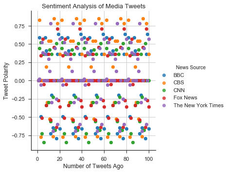
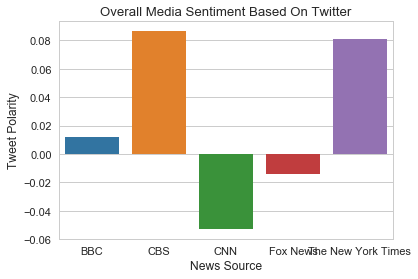

# Observable trends

Trend 1

CBS and the New York Times have the most overall positive score by a big margin compared to the other news sources.

Trend 2

CNN has the most negative overall score by a large margin.

Trend 3

The scatter plot shows the positive polarity of tweets by CBS and the New York Times.  You can see the large amount of negative polarity in the posts by CNN.


```python
# Load Dependencies
import pandas as pd
import matplotlib.pyplot as plt
import seaborn as sns
import numpy as np
import csv
import json
import tweepy
```


```python
# Import and Initialize Sentiment Analyzer
from vaderSentiment.vaderSentiment import SentimentIntensityAnalyzer
analyzer = SentimentIntensityAnalyzer()
```


```python
# Twitter API Keys
# The API Keys have been removed for the version posted to GitHub
consumer_key = ""
consumer_secret = ""
access_token = ""
access_token_secret = ""

# Setup Tweepy API Authentication
auth = tweepy.OAuthHandler(consumer_key, consumer_secret)
auth.set_access_token(access_token, access_token_secret)
api = tweepy.API(auth, parser=tweepy.parsers.JSONParser())
```


```python
# List of accounts to view
target_list = ("@BBC", "@CBS", "@CNN", "@FoxNews", "@nytimes")

# Lists to store results
user_list = []
tweet_list =[]
date_list =[]
compound_list = []
positive_list = []
negative_list = []
neutral_list = []
tweet_count = []
overall_avg_list = []
avg_user_list = []
temp_avg_list = []
```


```python
# Retrieve and run Vader Analysis on last 100 tweets
for target in target_list:
    count = 0
    for x in range(5):
        public_tweets = api.user_timeline(target)
        for tweet in public_tweets:
            
            # Display tweet as they are being fetched
            print(tweet["text"])
            
            # Count the number of Tweets
            count = count + 1
            tweet_count.append(count)
            
            # Store screen name, tweet text, and created date
            user_list.append(tweet["user"]["name"])
            tweet_list.append(tweet["text"])
            date_list.append(tweet["created_at"])
            
            # Analyze sentiment with Vader
            compound = analyzer.polarity_scores(tweet["text"])["compound"]
            pos = analyzer.polarity_scores(tweet["text"])["pos"]
            neu = analyzer.polarity_scores(tweet["text"])["neu"]
            neg = analyzer.polarity_scores(tweet["text"])["neg"]
            
            # Store the sentiment data
            compound_list.append(compound)
            positive_list.append(pos)
            negative_list.append(neg)
            neutral_list.append(neu)
            
            # Calcuate overall average score
            if count < 100:
                avg_single_tweet = compound
                temp_avg_list.append(avg_single_tweet)
            elif count == 100:
                avg_single_tweet = compound
                temp_avg_list.append(avg_single_tweet)
                overall_avg = np.mean(temp_avg_list)
                overall_avg_list.append(overall_avg)
                avg_user_list.append(tweet["user"]["name"])
                total_sum = 0
                overall_avg = 0
                temp_avg_list = []

# Display confirmation when complete
print ("----------------------------")
print ("----------------------------")
print ("----------COMPLETE----------")
print ("----------------------------")
print ("----------------------------")
```

    RT @BBCScotland: Let this be a lesson to us all...how NOT to split the bill. 
    
    From @MrQuippy https://t.co/wEGoJQm5Fe
    RT @bbcthree: Kids discussing hipsters is as amazing as you'd expect. https://t.co/7ZlwQbc8Bw
    RT @BBCScotland: Heroin exploded into housing schemes around Scotland in the early 80's changing policing and society forever.
    
    Watch the f…
    RT @BBCMOTD: 🎶 Doo doo doo doo doo doo doo doo doo doo doo doo doo doo doo… 🎶
    
    #FACup third round day always throws up some stories - today…
    DCI Hicks and DI Renko stumble on a lethal secret that will bind them together for life. 
    
    #HardSun | 9.35pm |… https://t.co/Tl7pjslOQZ
    👰🤵🏆 @reallorraine and @RobBeckettComic present as couples and their families come together for a wedding day like n… https://t.co/acOWVTDVKy
    Tonight, nature lover Hugh Fearnley-Whittingstall exlpores the wildlife of the West Country. 🐭🍃 
    
    Hugh's Wild West… https://t.co/GvNEA0JNz7
    We've made huge advances in eye care over the years, but will we ever be able to eliminate blindness? https://t.co/2IfDxktpiD
    'You feel like you’re in outer space.’
    How people in the Russian far east cope with living in -50 Celsius. ❄ https://t.co/YIgVe77Zey
    Who will stand the test of time and be remembered in 1,000 years? https://t.co/VpoJ0hQMlP https://t.co/ON7WonHhEC
    Todogganing 🐶🏂
    https://t.co/EFO7JRP77K
    These women in Pakistan are learning Mixed Martial Arts to fight against sexual harassment. 👊 https://t.co/TOVvhUN3cv
    RT @bbccomedy: Accidental likes? Buffering videos? Our parents have NO IDEA what we go through... 😭 https://t.co/E8R4OXVHcv
    Scientists are using a common virus used to help fight incurable brain cancer. 🔬 https://t.co/koLrDckPs4 https://t.co/yHjxJONrqi
    🐶🐱📆  Should workers be allowed 'paw-ternity leave' - paid time off to care for their pets? https://t.co/DUIlvg8MfD https://t.co/E0qGmCaicv
    RT @bbcworldservice: Why we can't resist puppy dog eyes. 🐶 📻 https://t.co/3tHzsHxw6O https://t.co/do6bcqnMQJ
    Battle stations people! We may be heading for a chocolate crisis. 🍫😫 https://t.co/n1Hefd02KG https://t.co/fXS6mvx088
    What a polar bear cub sounds like. ❤️️
    https://t.co/c8lWvBlo6U
    Want to help the wildlife in your backyard this winter? Here are some ideas for creating a 'winter menu’. 😋 https://t.co/1TG8z9n1wf
    Thousands of people have attempted to build the world's tallest Lego tower in memory of an eight-year-old cancer vi… https://t.co/mknHDReqM5
    RT @BBCScotland: Let this be a lesson to us all...how NOT to split the bill. 
    
    From @MrQuippy https://t.co/wEGoJQm5Fe
    RT @bbcthree: Kids discussing hipsters is as amazing as you'd expect. https://t.co/7ZlwQbc8Bw
    RT @BBCScotland: Heroin exploded into housing schemes around Scotland in the early 80's changing policing and society forever.
    
    Watch the f…
    RT @BBCMOTD: 🎶 Doo doo doo doo doo doo doo doo doo doo doo doo doo doo doo… 🎶
    
    #FACup third round day always throws up some stories - today…
    DCI Hicks and DI Renko stumble on a lethal secret that will bind them together for life. 
    
    #HardSun | 9.35pm |… https://t.co/Tl7pjslOQZ
    👰🤵🏆 @reallorraine and @RobBeckettComic present as couples and their families come together for a wedding day like n… https://t.co/acOWVTDVKy
    Tonight, nature lover Hugh Fearnley-Whittingstall exlpores the wildlife of the West Country. 🐭🍃 
    
    Hugh's Wild West… https://t.co/GvNEA0JNz7
    We've made huge advances in eye care over the years, but will we ever be able to eliminate blindness? https://t.co/2IfDxktpiD
    'You feel like you’re in outer space.’
    How people in the Russian far east cope with living in -50 Celsius. ❄ https://t.co/YIgVe77Zey
    Who will stand the test of time and be remembered in 1,000 years? https://t.co/VpoJ0hQMlP https://t.co/ON7WonHhEC
    Todogganing 🐶🏂
    https://t.co/EFO7JRP77K
    These women in Pakistan are learning Mixed Martial Arts to fight against sexual harassment. 👊 https://t.co/TOVvhUN3cv
    RT @bbccomedy: Accidental likes? Buffering videos? Our parents have NO IDEA what we go through... 😭 https://t.co/E8R4OXVHcv
    Scientists are using a common virus used to help fight incurable brain cancer. 🔬 https://t.co/koLrDckPs4 https://t.co/yHjxJONrqi
    🐶🐱📆  Should workers be allowed 'paw-ternity leave' - paid time off to care for their pets? https://t.co/DUIlvg8MfD https://t.co/E0qGmCaicv
    RT @bbcworldservice: Why we can't resist puppy dog eyes. 🐶 📻 https://t.co/3tHzsHxw6O https://t.co/do6bcqnMQJ
    Battle stations people! We may be heading for a chocolate crisis. 🍫😫 https://t.co/n1Hefd02KG https://t.co/fXS6mvx088
    What a polar bear cub sounds like. ❤️️
    https://t.co/c8lWvBlo6U
    Want to help the wildlife in your backyard this winter? Here are some ideas for creating a 'winter menu’. 😋 https://t.co/1TG8z9n1wf
    Thousands of people have attempted to build the world's tallest Lego tower in memory of an eight-year-old cancer vi… https://t.co/mknHDReqM5
    RT @BBCScotland: Let this be a lesson to us all...how NOT to split the bill. 
    
    From @MrQuippy https://t.co/wEGoJQm5Fe
    RT @bbcthree: Kids discussing hipsters is as amazing as you'd expect. https://t.co/7ZlwQbc8Bw
    RT @BBCScotland: Heroin exploded into housing schemes around Scotland in the early 80's changing policing and society forever.
    
    Watch the f…
    RT @BBCMOTD: 🎶 Doo doo doo doo doo doo doo doo doo doo doo doo doo doo doo… 🎶
    
    #FACup third round day always throws up some stories - today…
    DCI Hicks and DI Renko stumble on a lethal secret that will bind them together for life. 
    
    #HardSun | 9.35pm |… https://t.co/Tl7pjslOQZ
    👰🤵🏆 @reallorraine and @RobBeckettComic present as couples and their families come together for a wedding day like n… https://t.co/acOWVTDVKy
    Tonight, nature lover Hugh Fearnley-Whittingstall exlpores the wildlife of the West Country. 🐭🍃 
    
    Hugh's Wild West… https://t.co/GvNEA0JNz7
    We've made huge advances in eye care over the years, but will we ever be able to eliminate blindness? https://t.co/2IfDxktpiD
    'You feel like you’re in outer space.’
    How people in the Russian far east cope with living in -50 Celsius. ❄ https://t.co/YIgVe77Zey
    Who will stand the test of time and be remembered in 1,000 years? https://t.co/VpoJ0hQMlP https://t.co/ON7WonHhEC
    Todogganing 🐶🏂
    https://t.co/EFO7JRP77K
    These women in Pakistan are learning Mixed Martial Arts to fight against sexual harassment. 👊 https://t.co/TOVvhUN3cv
    RT @bbccomedy: Accidental likes? Buffering videos? Our parents have NO IDEA what we go through... 😭 https://t.co/E8R4OXVHcv
    Scientists are using a common virus used to help fight incurable brain cancer. 🔬 https://t.co/koLrDckPs4 https://t.co/yHjxJONrqi
    🐶🐱📆  Should workers be allowed 'paw-ternity leave' - paid time off to care for their pets? https://t.co/DUIlvg8MfD https://t.co/E0qGmCaicv
    RT @bbcworldservice: Why we can't resist puppy dog eyes. 🐶 📻 https://t.co/3tHzsHxw6O https://t.co/do6bcqnMQJ
    Battle stations people! We may be heading for a chocolate crisis. 🍫😫 https://t.co/n1Hefd02KG https://t.co/fXS6mvx088
    What a polar bear cub sounds like. ❤️️
    https://t.co/c8lWvBlo6U
    Want to help the wildlife in your backyard this winter? Here are some ideas for creating a 'winter menu’. 😋 https://t.co/1TG8z9n1wf
    Thousands of people have attempted to build the world's tallest Lego tower in memory of an eight-year-old cancer vi… https://t.co/mknHDReqM5
    RT @BBCScotland: Let this be a lesson to us all...how NOT to split the bill. 
    
    From @MrQuippy https://t.co/wEGoJQm5Fe
    RT @bbcthree: Kids discussing hipsters is as amazing as you'd expect. https://t.co/7ZlwQbc8Bw
    RT @BBCScotland: Heroin exploded into housing schemes around Scotland in the early 80's changing policing and society forever.
    
    Watch the f…
    RT @BBCMOTD: 🎶 Doo doo doo doo doo doo doo doo doo doo doo doo doo doo doo… 🎶
    
    #FACup third round day always throws up some stories - today…
    DCI Hicks and DI Renko stumble on a lethal secret that will bind them together for life. 
    
    #HardSun | 9.35pm |… https://t.co/Tl7pjslOQZ
    👰🤵🏆 @reallorraine and @RobBeckettComic present as couples and their families come together for a wedding day like n… https://t.co/acOWVTDVKy
    Tonight, nature lover Hugh Fearnley-Whittingstall exlpores the wildlife of the West Country. 🐭🍃 
    
    Hugh's Wild West… https://t.co/GvNEA0JNz7
    We've made huge advances in eye care over the years, but will we ever be able to eliminate blindness? https://t.co/2IfDxktpiD
    'You feel like you’re in outer space.’
    How people in the Russian far east cope with living in -50 Celsius. ❄ https://t.co/YIgVe77Zey
    Who will stand the test of time and be remembered in 1,000 years? https://t.co/VpoJ0hQMlP https://t.co/ON7WonHhEC
    Todogganing 🐶🏂
    https://t.co/EFO7JRP77K
    These women in Pakistan are learning Mixed Martial Arts to fight against sexual harassment. 👊 https://t.co/TOVvhUN3cv
    RT @bbccomedy: Accidental likes? Buffering videos? Our parents have NO IDEA what we go through... 😭 https://t.co/E8R4OXVHcv
    Scientists are using a common virus used to help fight incurable brain cancer. 🔬 https://t.co/koLrDckPs4 https://t.co/yHjxJONrqi
    🐶🐱📆  Should workers be allowed 'paw-ternity leave' - paid time off to care for their pets? https://t.co/DUIlvg8MfD https://t.co/E0qGmCaicv
    RT @bbcworldservice: Why we can't resist puppy dog eyes. 🐶 📻 https://t.co/3tHzsHxw6O https://t.co/do6bcqnMQJ
    Battle stations people! We may be heading for a chocolate crisis. 🍫😫 https://t.co/n1Hefd02KG https://t.co/fXS6mvx088
    What a polar bear cub sounds like. ❤️️
    https://t.co/c8lWvBlo6U
    Want to help the wildlife in your backyard this winter? Here are some ideas for creating a 'winter menu’. 😋 https://t.co/1TG8z9n1wf
    Thousands of people have attempted to build the world's tallest Lego tower in memory of an eight-year-old cancer vi… https://t.co/mknHDReqM5
    RT @BBCScotland: Let this be a lesson to us all...how NOT to split the bill. 
    
    From @MrQuippy https://t.co/wEGoJQm5Fe
    RT @bbcthree: Kids discussing hipsters is as amazing as you'd expect. https://t.co/7ZlwQbc8Bw
    RT @BBCScotland: Heroin exploded into housing schemes around Scotland in the early 80's changing policing and society forever.
    
    Watch the f…
    RT @BBCMOTD: 🎶 Doo doo doo doo doo doo doo doo doo doo doo doo doo doo doo… 🎶
    
    #FACup third round day always throws up some stories - today…
    DCI Hicks and DI Renko stumble on a lethal secret that will bind them together for life. 
    
    #HardSun | 9.35pm |… https://t.co/Tl7pjslOQZ
    👰🤵🏆 @reallorraine and @RobBeckettComic present as couples and their families come together for a wedding day like n… https://t.co/acOWVTDVKy
    Tonight, nature lover Hugh Fearnley-Whittingstall exlpores the wildlife of the West Country. 🐭🍃 
    
    Hugh's Wild West… https://t.co/GvNEA0JNz7
    We've made huge advances in eye care over the years, but will we ever be able to eliminate blindness? https://t.co/2IfDxktpiD
    'You feel like you’re in outer space.’
    How people in the Russian far east cope with living in -50 Celsius. ❄ https://t.co/YIgVe77Zey
    Who will stand the test of time and be remembered in 1,000 years? https://t.co/VpoJ0hQMlP https://t.co/ON7WonHhEC
    Todogganing 🐶🏂
    https://t.co/EFO7JRP77K
    These women in Pakistan are learning Mixed Martial Arts to fight against sexual harassment. 👊 https://t.co/TOVvhUN3cv
    RT @bbccomedy: Accidental likes? Buffering videos? Our parents have NO IDEA what we go through... 😭 https://t.co/E8R4OXVHcv
    Scientists are using a common virus used to help fight incurable brain cancer. 🔬 https://t.co/koLrDckPs4 https://t.co/yHjxJONrqi
    🐶🐱📆  Should workers be allowed 'paw-ternity leave' - paid time off to care for their pets? https://t.co/DUIlvg8MfD https://t.co/E0qGmCaicv
    RT @bbcworldservice: Why we can't resist puppy dog eyes. 🐶 📻 https://t.co/3tHzsHxw6O https://t.co/do6bcqnMQJ
    Battle stations people! We may be heading for a chocolate crisis. 🍫😫 https://t.co/n1Hefd02KG https://t.co/fXS6mvx088
    What a polar bear cub sounds like. ❤️️
    https://t.co/c8lWvBlo6U
    Want to help the wildlife in your backyard this winter? Here are some ideas for creating a 'winter menu’. 😋 https://t.co/1TG8z9n1wf
    Thousands of people have attempted to build the world's tallest Lego tower in memory of an eight-year-old cancer vi… https://t.co/mknHDReqM5
    RT @debrabirnbaum: .@ShawnRyanTV: To me, being on CBS is the opposite of preaching to the choir. #TCA18
    RT @LivinBiblically: “The truth is it somehow gorgeously straddles both sides...I have had friends come from all different walks of life an…
    RT @instinctcbs: “This is a crime show where at the end you’re not reminded of how miserable things are in the world right now…You feel sat…
    RT @startrekcbs: Star Trek has touched the lives of generations of fans, including the cast and writers of #StarTrekDiscovery. What's your…
    #StrangeAngel has found its leading man! Jack Reynor will star as famed rocket engineer Jack Parsons in the upcomin… https://t.co/sHkSKABGfd
    The streak of new episodes continues! Watch new episodes of #MacGyver, #H50 &amp; #BlueBloods tonight starting at 8/7c.… https://t.co/xs2vbVqBJZ
    RT @CBSTweet: #CBSRatingsNews: CBS Sweeps Fourth Quarter Ratings in Daytime, Primetime and Late Night for the First Time Since 2009 https:/…
    New year, new episodes! Don't miss all-new episodes of @BigBangTheory, @YoungSheldon, @MomCBS, @LifeInPiecesCBS, an… https://t.co/COf6Qg8Mz1
    Current nominees @LadyGaga, @LittleBigTown, @Pink, Childish Gambino and more will perform live at the #GRAMMYs, Jan… https://t.co/PlLMasNPwD
    RT @startrekcbs: From Airiam to Zefram Cochrane, #StarTrekDiscovery features fascinating new concepts along with classic references. What's…
    Torres and Bishop went undercover as a criminal couple on the latest episode of #NCIS. Catch up now:… https://t.co/1iTEneHyJS
    Do you know all the nominees for Artist Of The Year? Get familiar with this year's GRAMMY® Award nominees ahead of… https://t.co/UQa8Mu9PUV
    The new year of new episodes continues tonight with all-new episodes of #AmazingRace, #SEALTeam and #CriminalMinds… https://t.co/bwhNhQgsFC
    RT @BullCBS: Tonight, can #Bull prove that a teen accused of robbing a jewelry store isn't responsible for the crime? Tune in at 9/8c or st…
    It's your last chance to choose the pro football player with the best off-the-field talent! Vote now to decide who… https://t.co/6DjwqU0MB9
    New year, new episodes -- all week long! It kicks off with an all-new #NCIS, #Bull and #NCISNOLA tonight starting a… https://t.co/bcmAaUQJtf
    Due to #NFL football games overrun, revised start times &amp; lineup for Eastern/Central Time Zones Only:
    #60Minutes 8:… https://t.co/rqOYbM5j0h
    Get ready for football! Stream NFL on CBS today with #CBSAllAccess. Try 1 month FREE with promo code BINGE (not ava… https://t.co/NEntvW7QHd
    RT @NoActivityCBS: All season nothing's happened. Now prepare for activity. Stream the #NoActivity season finale Sunday, Dec 31 on CBS All…
    RT @startrekcbs: Find out what happens when you boldly go too far. #StarTrekDiscovery continues January 7 on CBS All Access: https://t.co/f…
    RT @debrabirnbaum: .@ShawnRyanTV: To me, being on CBS is the opposite of preaching to the choir. #TCA18
    RT @LivinBiblically: “The truth is it somehow gorgeously straddles both sides...I have had friends come from all different walks of life an…
    RT @instinctcbs: “This is a crime show where at the end you’re not reminded of how miserable things are in the world right now…You feel sat…
    RT @startrekcbs: Star Trek has touched the lives of generations of fans, including the cast and writers of #StarTrekDiscovery. What's your…
    #StrangeAngel has found its leading man! Jack Reynor will star as famed rocket engineer Jack Parsons in the upcomin… https://t.co/sHkSKABGfd
    The streak of new episodes continues! Watch new episodes of #MacGyver, #H50 &amp; #BlueBloods tonight starting at 8/7c.… https://t.co/xs2vbVqBJZ
    RT @CBSTweet: #CBSRatingsNews: CBS Sweeps Fourth Quarter Ratings in Daytime, Primetime and Late Night for the First Time Since 2009 https:/…
    New year, new episodes! Don't miss all-new episodes of @BigBangTheory, @YoungSheldon, @MomCBS, @LifeInPiecesCBS, an… https://t.co/COf6Qg8Mz1
    Current nominees @LadyGaga, @LittleBigTown, @Pink, Childish Gambino and more will perform live at the #GRAMMYs, Jan… https://t.co/PlLMasNPwD
    RT @startrekcbs: From Airiam to Zefram Cochrane, #StarTrekDiscovery features fascinating new concepts along with classic references. What's…
    Torres and Bishop went undercover as a criminal couple on the latest episode of #NCIS. Catch up now:… https://t.co/1iTEneHyJS
    Do you know all the nominees for Artist Of The Year? Get familiar with this year's GRAMMY® Award nominees ahead of… https://t.co/UQa8Mu9PUV
    The new year of new episodes continues tonight with all-new episodes of #AmazingRace, #SEALTeam and #CriminalMinds… https://t.co/bwhNhQgsFC
    RT @BullCBS: Tonight, can #Bull prove that a teen accused of robbing a jewelry store isn't responsible for the crime? Tune in at 9/8c or st…
    It's your last chance to choose the pro football player with the best off-the-field talent! Vote now to decide who… https://t.co/6DjwqU0MB9
    New year, new episodes -- all week long! It kicks off with an all-new #NCIS, #Bull and #NCISNOLA tonight starting a… https://t.co/bcmAaUQJtf
    Due to #NFL football games overrun, revised start times &amp; lineup for Eastern/Central Time Zones Only:
    #60Minutes 8:… https://t.co/rqOYbM5j0h
    Get ready for football! Stream NFL on CBS today with #CBSAllAccess. Try 1 month FREE with promo code BINGE (not ava… https://t.co/NEntvW7QHd
    RT @NoActivityCBS: All season nothing's happened. Now prepare for activity. Stream the #NoActivity season finale Sunday, Dec 31 on CBS All…
    RT @startrekcbs: Find out what happens when you boldly go too far. #StarTrekDiscovery continues January 7 on CBS All Access: https://t.co/f…
    RT @debrabirnbaum: .@ShawnRyanTV: To me, being on CBS is the opposite of preaching to the choir. #TCA18
    RT @LivinBiblically: “The truth is it somehow gorgeously straddles both sides...I have had friends come from all different walks of life an…
    RT @instinctcbs: “This is a crime show where at the end you’re not reminded of how miserable things are in the world right now…You feel sat…
    RT @startrekcbs: Star Trek has touched the lives of generations of fans, including the cast and writers of #StarTrekDiscovery. What's your…
    #StrangeAngel has found its leading man! Jack Reynor will star as famed rocket engineer Jack Parsons in the upcomin… https://t.co/sHkSKABGfd
    The streak of new episodes continues! Watch new episodes of #MacGyver, #H50 &amp; #BlueBloods tonight starting at 8/7c.… https://t.co/xs2vbVqBJZ
    RT @CBSTweet: #CBSRatingsNews: CBS Sweeps Fourth Quarter Ratings in Daytime, Primetime and Late Night for the First Time Since 2009 https:/…
    New year, new episodes! Don't miss all-new episodes of @BigBangTheory, @YoungSheldon, @MomCBS, @LifeInPiecesCBS, an… https://t.co/COf6Qg8Mz1
    Current nominees @LadyGaga, @LittleBigTown, @Pink, Childish Gambino and more will perform live at the #GRAMMYs, Jan… https://t.co/PlLMasNPwD
    RT @startrekcbs: From Airiam to Zefram Cochrane, #StarTrekDiscovery features fascinating new concepts along with classic references. What's…
    Torres and Bishop went undercover as a criminal couple on the latest episode of #NCIS. Catch up now:… https://t.co/1iTEneHyJS
    Do you know all the nominees for Artist Of The Year? Get familiar with this year's GRAMMY® Award nominees ahead of… https://t.co/UQa8Mu9PUV
    The new year of new episodes continues tonight with all-new episodes of #AmazingRace, #SEALTeam and #CriminalMinds… https://t.co/bwhNhQgsFC
    RT @BullCBS: Tonight, can #Bull prove that a teen accused of robbing a jewelry store isn't responsible for the crime? Tune in at 9/8c or st…
    It's your last chance to choose the pro football player with the best off-the-field talent! Vote now to decide who… https://t.co/6DjwqU0MB9
    New year, new episodes -- all week long! It kicks off with an all-new #NCIS, #Bull and #NCISNOLA tonight starting a… https://t.co/bcmAaUQJtf
    Due to #NFL football games overrun, revised start times &amp; lineup for Eastern/Central Time Zones Only:
    #60Minutes 8:… https://t.co/rqOYbM5j0h
    Get ready for football! Stream NFL on CBS today with #CBSAllAccess. Try 1 month FREE with promo code BINGE (not ava… https://t.co/NEntvW7QHd
    RT @NoActivityCBS: All season nothing's happened. Now prepare for activity. Stream the #NoActivity season finale Sunday, Dec 31 on CBS All…
    RT @startrekcbs: Find out what happens when you boldly go too far. #StarTrekDiscovery continues January 7 on CBS All Access: https://t.co/f…
    RT @debrabirnbaum: .@ShawnRyanTV: To me, being on CBS is the opposite of preaching to the choir. #TCA18
    RT @LivinBiblically: “The truth is it somehow gorgeously straddles both sides...I have had friends come from all different walks of life an…
    RT @instinctcbs: “This is a crime show where at the end you’re not reminded of how miserable things are in the world right now…You feel sat…
    RT @startrekcbs: Star Trek has touched the lives of generations of fans, including the cast and writers of #StarTrekDiscovery. What's your…
    #StrangeAngel has found its leading man! Jack Reynor will star as famed rocket engineer Jack Parsons in the upcomin… https://t.co/sHkSKABGfd
    The streak of new episodes continues! Watch new episodes of #MacGyver, #H50 &amp; #BlueBloods tonight starting at 8/7c.… https://t.co/xs2vbVqBJZ
    RT @CBSTweet: #CBSRatingsNews: CBS Sweeps Fourth Quarter Ratings in Daytime, Primetime and Late Night for the First Time Since 2009 https:/…
    New year, new episodes! Don't miss all-new episodes of @BigBangTheory, @YoungSheldon, @MomCBS, @LifeInPiecesCBS, an… https://t.co/COf6Qg8Mz1
    Current nominees @LadyGaga, @LittleBigTown, @Pink, Childish Gambino and more will perform live at the #GRAMMYs, Jan… https://t.co/PlLMasNPwD
    RT @startrekcbs: From Airiam to Zefram Cochrane, #StarTrekDiscovery features fascinating new concepts along with classic references. What's…
    Torres and Bishop went undercover as a criminal couple on the latest episode of #NCIS. Catch up now:… https://t.co/1iTEneHyJS
    Do you know all the nominees for Artist Of The Year? Get familiar with this year's GRAMMY® Award nominees ahead of… https://t.co/UQa8Mu9PUV
    The new year of new episodes continues tonight with all-new episodes of #AmazingRace, #SEALTeam and #CriminalMinds… https://t.co/bwhNhQgsFC
    RT @BullCBS: Tonight, can #Bull prove that a teen accused of robbing a jewelry store isn't responsible for the crime? Tune in at 9/8c or st…
    It's your last chance to choose the pro football player with the best off-the-field talent! Vote now to decide who… https://t.co/6DjwqU0MB9
    New year, new episodes -- all week long! It kicks off with an all-new #NCIS, #Bull and #NCISNOLA tonight starting a… https://t.co/bcmAaUQJtf
    Due to #NFL football games overrun, revised start times &amp; lineup for Eastern/Central Time Zones Only:
    #60Minutes 8:… https://t.co/rqOYbM5j0h
    Get ready for football! Stream NFL on CBS today with #CBSAllAccess. Try 1 month FREE with promo code BINGE (not ava… https://t.co/NEntvW7QHd
    RT @NoActivityCBS: All season nothing's happened. Now prepare for activity. Stream the #NoActivity season finale Sunday, Dec 31 on CBS All…
    RT @startrekcbs: Find out what happens when you boldly go too far. #StarTrekDiscovery continues January 7 on CBS All Access: https://t.co/f…
    RT @debrabirnbaum: .@ShawnRyanTV: To me, being on CBS is the opposite of preaching to the choir. #TCA18
    RT @LivinBiblically: “The truth is it somehow gorgeously straddles both sides...I have had friends come from all different walks of life an…
    RT @instinctcbs: “This is a crime show where at the end you’re not reminded of how miserable things are in the world right now…You feel sat…
    RT @startrekcbs: Star Trek has touched the lives of generations of fans, including the cast and writers of #StarTrekDiscovery. What's your…
    #StrangeAngel has found its leading man! Jack Reynor will star as famed rocket engineer Jack Parsons in the upcomin… https://t.co/sHkSKABGfd
    The streak of new episodes continues! Watch new episodes of #MacGyver, #H50 &amp; #BlueBloods tonight starting at 8/7c.… https://t.co/xs2vbVqBJZ
    RT @CBSTweet: #CBSRatingsNews: CBS Sweeps Fourth Quarter Ratings in Daytime, Primetime and Late Night for the First Time Since 2009 https:/…
    New year, new episodes! Don't miss all-new episodes of @BigBangTheory, @YoungSheldon, @MomCBS, @LifeInPiecesCBS, an… https://t.co/COf6Qg8Mz1
    Current nominees @LadyGaga, @LittleBigTown, @Pink, Childish Gambino and more will perform live at the #GRAMMYs, Jan… https://t.co/PlLMasNPwD
    RT @startrekcbs: From Airiam to Zefram Cochrane, #StarTrekDiscovery features fascinating new concepts along with classic references. What's…
    Torres and Bishop went undercover as a criminal couple on the latest episode of #NCIS. Catch up now:… https://t.co/1iTEneHyJS
    Do you know all the nominees for Artist Of The Year? Get familiar with this year's GRAMMY® Award nominees ahead of… https://t.co/UQa8Mu9PUV
    The new year of new episodes continues tonight with all-new episodes of #AmazingRace, #SEALTeam and #CriminalMinds… https://t.co/bwhNhQgsFC
    RT @BullCBS: Tonight, can #Bull prove that a teen accused of robbing a jewelry store isn't responsible for the crime? Tune in at 9/8c or st…
    It's your last chance to choose the pro football player with the best off-the-field talent! Vote now to decide who… https://t.co/6DjwqU0MB9
    New year, new episodes -- all week long! It kicks off with an all-new #NCIS, #Bull and #NCISNOLA tonight starting a… https://t.co/bcmAaUQJtf
    Due to #NFL football games overrun, revised start times &amp; lineup for Eastern/Central Time Zones Only:
    #60Minutes 8:… https://t.co/rqOYbM5j0h
    Get ready for football! Stream NFL on CBS today with #CBSAllAccess. Try 1 month FREE with promo code BINGE (not ava… https://t.co/NEntvW7QHd
    RT @NoActivityCBS: All season nothing's happened. Now prepare for activity. Stream the #NoActivity season finale Sunday, Dec 31 on CBS All…
    RT @startrekcbs: Find out what happens when you boldly go too far. #StarTrekDiscovery continues January 7 on CBS All Access: https://t.co/f…
    It takes 300 people, 12,000 parts and a year to make a single Steinway &amp; Sons piano. Here’s how the pianos are made… https://t.co/F9wPh0n4wl
    President Trump is expected to attend the college football national championship https://t.co/FcbSkjDIPR https://t.co/d9X99hW2IB
    Ripple's recent price spike has made it the second most valuable cryptocurrency after bitcoin. Here's how it works… https://t.co/iap2wkrr8d
    Democratic mega-donor and billionaire environmentalist Tom Steyer has purchased a copy of "Fire and Fury" for every… https://t.co/WuZurYb7fs
    This is what subzero temperature looks like https://t.co/BT8H3eMVq8 https://t.co/F0Mm0KY4DN
    Former White House chief strategist Steve Bannon was going to attack "Fire and Fury" author Michael Wolff over quot… https://t.co/6CfJROgVYy
    Taco Bell is planning to roll out $1 nacho fries — with a side of cheese sauce https://t.co/0aketnp0VB https://t.co/7xfnNYoyL2
    Part of the Nashville skyline disappears as the former Centennial Tower and LifeWay building falls in a scheduled i… https://t.co/DgOnxzSkZw
    This is why we just can't quit Hillary Clinton https://t.co/NZ0o4xutSR (via @CNNOpinion) https://t.co/UrI8LlNCNS
    More White House officials were involved in an effort to pressure Attorney General Jeff Sessions to not recuse hims… https://t.co/MtxjFAQ0Ae
    Eating fish improves kids' IQ scores and sleep, a new study says https://t.co/8iB0etPZON https://t.co/nBUp2rXM6K
    Ex-astronaut John Young has died at age 87. He walked on the moon and commanded the first space shuttle flight.… https://t.co/OYAKxSLNnx
    Should Democrats shake President Trump's hand and make this deal? https://t.co/O7Gv0CGthy (via @CNNOpinion) https://t.co/QtUP7mHJZ2
    Judge allows lawsuit against CBS by brother of JonBenét Ramsey to proceed https://t.co/5WW0Y8iYYC https://t.co/bzlx9IbKhd
    Former Republican congressman Ron Paul blasts Attorney General Jeff Sessions' decision to rescind the Obama-era pol… https://t.co/sQeKBD9sS3
    Tech executive raises $100,000 for Roy Moore accuser after a fire destroyed her home this week… https://t.co/X2bOSMJHez
    A perennial southern powerhouse playing another perennial southern powerhouse in a stadium that looks like a cavern… https://t.co/dB9vHbth9h
    President Trump defends his sanity amid questions about his mental state https://t.co/uXcq1rnZA7 https://t.co/TDZruiLoNn
    These are 6 tech trends to watch at this year's International Consumer Electronics Show https://t.co/L1ikeGeajG https://t.co/kdax92hIKU
    President Trump says he's open to talking with North Korean leader Kim Jong Un https://t.co/22PUjttm7e https://t.co/iAoJgvsKS6
    It takes 300 people, 12,000 parts and a year to make a single Steinway &amp; Sons piano. Here’s how the pianos are made… https://t.co/F9wPh0n4wl
    President Trump is expected to attend the college football national championship https://t.co/FcbSkjDIPR https://t.co/d9X99hW2IB
    Ripple's recent price spike has made it the second most valuable cryptocurrency after bitcoin. Here's how it works… https://t.co/iap2wkrr8d
    Democratic mega-donor and billionaire environmentalist Tom Steyer has purchased a copy of "Fire and Fury" for every… https://t.co/WuZurYb7fs
    This is what subzero temperature looks like https://t.co/BT8H3eMVq8 https://t.co/F0Mm0KY4DN
    Former White House chief strategist Steve Bannon was going to attack "Fire and Fury" author Michael Wolff over quot… https://t.co/6CfJROgVYy
    Taco Bell is planning to roll out $1 nacho fries — with a side of cheese sauce https://t.co/0aketnp0VB https://t.co/7xfnNYoyL2
    Part of the Nashville skyline disappears as the former Centennial Tower and LifeWay building falls in a scheduled i… https://t.co/DgOnxzSkZw
    This is why we just can't quit Hillary Clinton https://t.co/NZ0o4xutSR (via @CNNOpinion) https://t.co/UrI8LlNCNS
    More White House officials were involved in an effort to pressure Attorney General Jeff Sessions to not recuse hims… https://t.co/MtxjFAQ0Ae
    Eating fish improves kids' IQ scores and sleep, a new study says https://t.co/8iB0etPZON https://t.co/nBUp2rXM6K
    Ex-astronaut John Young has died at age 87. He walked on the moon and commanded the first space shuttle flight.… https://t.co/OYAKxSLNnx
    Should Democrats shake President Trump's hand and make this deal? https://t.co/O7Gv0CGthy (via @CNNOpinion) https://t.co/QtUP7mHJZ2
    Judge allows lawsuit against CBS by brother of JonBenét Ramsey to proceed https://t.co/5WW0Y8iYYC https://t.co/bzlx9IbKhd
    Former Republican congressman Ron Paul blasts Attorney General Jeff Sessions' decision to rescind the Obama-era pol… https://t.co/sQeKBD9sS3
    Tech executive raises $100,000 for Roy Moore accuser after a fire destroyed her home this week… https://t.co/X2bOSMJHez
    A perennial southern powerhouse playing another perennial southern powerhouse in a stadium that looks like a cavern… https://t.co/dB9vHbth9h
    President Trump defends his sanity amid questions about his mental state https://t.co/uXcq1rnZA7 https://t.co/TDZruiLoNn
    These are 6 tech trends to watch at this year's International Consumer Electronics Show https://t.co/L1ikeGeajG https://t.co/kdax92hIKU
    President Trump says he's open to talking with North Korean leader Kim Jong Un https://t.co/22PUjttm7e https://t.co/iAoJgvsKS6
    It takes 300 people, 12,000 parts and a year to make a single Steinway &amp; Sons piano. Here’s how the pianos are made… https://t.co/F9wPh0n4wl
    President Trump is expected to attend the college football national championship https://t.co/FcbSkjDIPR https://t.co/d9X99hW2IB
    Ripple's recent price spike has made it the second most valuable cryptocurrency after bitcoin. Here's how it works… https://t.co/iap2wkrr8d
    Democratic mega-donor and billionaire environmentalist Tom Steyer has purchased a copy of "Fire and Fury" for every… https://t.co/WuZurYb7fs
    This is what subzero temperature looks like https://t.co/BT8H3eMVq8 https://t.co/F0Mm0KY4DN
    Former White House chief strategist Steve Bannon was going to attack "Fire and Fury" author Michael Wolff over quot… https://t.co/6CfJROgVYy
    Taco Bell is planning to roll out $1 nacho fries — with a side of cheese sauce https://t.co/0aketnp0VB https://t.co/7xfnNYoyL2
    Part of the Nashville skyline disappears as the former Centennial Tower and LifeWay building falls in a scheduled i… https://t.co/DgOnxzSkZw
    This is why we just can't quit Hillary Clinton https://t.co/NZ0o4xutSR (via @CNNOpinion) https://t.co/UrI8LlNCNS
    More White House officials were involved in an effort to pressure Attorney General Jeff Sessions to not recuse hims… https://t.co/MtxjFAQ0Ae
    Eating fish improves kids' IQ scores and sleep, a new study says https://t.co/8iB0etPZON https://t.co/nBUp2rXM6K
    Ex-astronaut John Young has died at age 87. He walked on the moon and commanded the first space shuttle flight.… https://t.co/OYAKxSLNnx
    Should Democrats shake President Trump's hand and make this deal? https://t.co/O7Gv0CGthy (via @CNNOpinion) https://t.co/QtUP7mHJZ2
    Judge allows lawsuit against CBS by brother of JonBenét Ramsey to proceed https://t.co/5WW0Y8iYYC https://t.co/bzlx9IbKhd
    Former Republican congressman Ron Paul blasts Attorney General Jeff Sessions' decision to rescind the Obama-era pol… https://t.co/sQeKBD9sS3
    Tech executive raises $100,000 for Roy Moore accuser after a fire destroyed her home this week… https://t.co/X2bOSMJHez
    A perennial southern powerhouse playing another perennial southern powerhouse in a stadium that looks like a cavern… https://t.co/dB9vHbth9h
    President Trump defends his sanity amid questions about his mental state https://t.co/uXcq1rnZA7 https://t.co/TDZruiLoNn
    These are 6 tech trends to watch at this year's International Consumer Electronics Show https://t.co/L1ikeGeajG https://t.co/kdax92hIKU
    President Trump says he's open to talking with North Korean leader Kim Jong Un https://t.co/22PUjttm7e https://t.co/iAoJgvsKS6
    It takes 300 people, 12,000 parts and a year to make a single Steinway &amp; Sons piano. Here’s how the pianos are made… https://t.co/F9wPh0n4wl
    President Trump is expected to attend the college football national championship https://t.co/FcbSkjDIPR https://t.co/d9X99hW2IB
    Ripple's recent price spike has made it the second most valuable cryptocurrency after bitcoin. Here's how it works… https://t.co/iap2wkrr8d
    Democratic mega-donor and billionaire environmentalist Tom Steyer has purchased a copy of "Fire and Fury" for every… https://t.co/WuZurYb7fs
    This is what subzero temperature looks like https://t.co/BT8H3eMVq8 https://t.co/F0Mm0KY4DN
    Former White House chief strategist Steve Bannon was going to attack "Fire and Fury" author Michael Wolff over quot… https://t.co/6CfJROgVYy
    Taco Bell is planning to roll out $1 nacho fries — with a side of cheese sauce https://t.co/0aketnp0VB https://t.co/7xfnNYoyL2
    Part of the Nashville skyline disappears as the former Centennial Tower and LifeWay building falls in a scheduled i… https://t.co/DgOnxzSkZw
    This is why we just can't quit Hillary Clinton https://t.co/NZ0o4xutSR (via @CNNOpinion) https://t.co/UrI8LlNCNS
    More White House officials were involved in an effort to pressure Attorney General Jeff Sessions to not recuse hims… https://t.co/MtxjFAQ0Ae
    Eating fish improves kids' IQ scores and sleep, a new study says https://t.co/8iB0etPZON https://t.co/nBUp2rXM6K
    Ex-astronaut John Young has died at age 87. He walked on the moon and commanded the first space shuttle flight.… https://t.co/OYAKxSLNnx
    Should Democrats shake President Trump's hand and make this deal? https://t.co/O7Gv0CGthy (via @CNNOpinion) https://t.co/QtUP7mHJZ2
    Judge allows lawsuit against CBS by brother of JonBenét Ramsey to proceed https://t.co/5WW0Y8iYYC https://t.co/bzlx9IbKhd
    Former Republican congressman Ron Paul blasts Attorney General Jeff Sessions' decision to rescind the Obama-era pol… https://t.co/sQeKBD9sS3
    Tech executive raises $100,000 for Roy Moore accuser after a fire destroyed her home this week… https://t.co/X2bOSMJHez
    A perennial southern powerhouse playing another perennial southern powerhouse in a stadium that looks like a cavern… https://t.co/dB9vHbth9h
    President Trump defends his sanity amid questions about his mental state https://t.co/uXcq1rnZA7 https://t.co/TDZruiLoNn
    These are 6 tech trends to watch at this year's International Consumer Electronics Show https://t.co/L1ikeGeajG https://t.co/kdax92hIKU
    President Trump says he's open to talking with North Korean leader Kim Jong Un https://t.co/22PUjttm7e https://t.co/iAoJgvsKS6
    It takes 300 people, 12,000 parts and a year to make a single Steinway &amp; Sons piano. Here’s how the pianos are made… https://t.co/F9wPh0n4wl
    President Trump is expected to attend the college football national championship https://t.co/FcbSkjDIPR https://t.co/d9X99hW2IB
    Ripple's recent price spike has made it the second most valuable cryptocurrency after bitcoin. Here's how it works… https://t.co/iap2wkrr8d
    Democratic mega-donor and billionaire environmentalist Tom Steyer has purchased a copy of "Fire and Fury" for every… https://t.co/WuZurYb7fs
    This is what subzero temperature looks like https://t.co/BT8H3eMVq8 https://t.co/F0Mm0KY4DN
    Former White House chief strategist Steve Bannon was going to attack "Fire and Fury" author Michael Wolff over quot… https://t.co/6CfJROgVYy
    Taco Bell is planning to roll out $1 nacho fries — with a side of cheese sauce https://t.co/0aketnp0VB https://t.co/7xfnNYoyL2
    Part of the Nashville skyline disappears as the former Centennial Tower and LifeWay building falls in a scheduled i… https://t.co/DgOnxzSkZw
    This is why we just can't quit Hillary Clinton https://t.co/NZ0o4xutSR (via @CNNOpinion) https://t.co/UrI8LlNCNS
    More White House officials were involved in an effort to pressure Attorney General Jeff Sessions to not recuse hims… https://t.co/MtxjFAQ0Ae
    Eating fish improves kids' IQ scores and sleep, a new study says https://t.co/8iB0etPZON https://t.co/nBUp2rXM6K
    Ex-astronaut John Young has died at age 87. He walked on the moon and commanded the first space shuttle flight.… https://t.co/OYAKxSLNnx
    Should Democrats shake President Trump's hand and make this deal? https://t.co/O7Gv0CGthy (via @CNNOpinion) https://t.co/QtUP7mHJZ2
    Judge allows lawsuit against CBS by brother of JonBenét Ramsey to proceed https://t.co/5WW0Y8iYYC https://t.co/bzlx9IbKhd
    Former Republican congressman Ron Paul blasts Attorney General Jeff Sessions' decision to rescind the Obama-era pol… https://t.co/sQeKBD9sS3
    Tech executive raises $100,000 for Roy Moore accuser after a fire destroyed her home this week… https://t.co/X2bOSMJHez
    A perennial southern powerhouse playing another perennial southern powerhouse in a stadium that looks like a cavern… https://t.co/dB9vHbth9h
    President Trump defends his sanity amid questions about his mental state https://t.co/uXcq1rnZA7 https://t.co/TDZruiLoNn
    These are 6 tech trends to watch at this year's International Consumer Electronics Show https://t.co/L1ikeGeajG https://t.co/kdax92hIKU
    President Trump says he's open to talking with North Korean leader Kim Jong Un https://t.co/22PUjttm7e https://t.co/iAoJgvsKS6
    .@POTUS: "The wall's going to happen or we're not going to have DACA." https://t.co/jo9DM3thj8 https://t.co/kBdLaCfQNk
    .@POTUS: "[Michael Wolff] didn't interview me. It's in his imagination." https://t.co/tCsh53Hebk https://t.co/fof94OcPw0
    .@SebGorka: "One thing I can assure you is that wall will be built." https://t.co/WKnu6O4gZT
    Trump backs Sen. Paul's plan to fund infrastructure projects with suspended aid to Pakistan https://t.co/4raLtlQ8IN
    This morning, President @realDonaldTrump celebrated the economic numbers for African Americans.… https://t.co/w0ZFeExNKT
    'Schumer's From New York': Trump Says Dems Will Help With Immigration Reform After NYC Attacks https://t.co/XOId1yF5G5
    .@AriFleischer on Clinton Foundation probe: "This investigation is not a sham, it's a leftover. A leftover from the… https://t.co/W1wZBGzIlF
    New Philadelphia DA shakes up office, firing 31 on 4th day in job https://t.co/NxNoRHC054
    Oakland Raiders officially announce Jon Gruden hired as head coach https://t.co/bt30S69oMw
    Col. David Hunt on Iran protests: "What we ultimately want is an overthrow of a very powerful regime. I don't think… https://t.co/4FywYoHVSA
    David Goodfriend on @POTUS and the media: "The people who voted for President Trump I think recognize that he's the… https://t.co/fRr8I3mQIj
    .@SebGorka on new Clinton probe: "We saw FBI agents destroy Clinton's laptops. That's corruption." @JudgeJeanine https://t.co/wAVctxoQUB
    .@SebGorka on new Clinton probe: "This has to be investigated preferably by FBI agents from field offices that have… https://t.co/lO9m5462IW
    .@Jim_Jordan on Clinton probe: "Until this week, we hadn't seen much difference between this attorney general and t… https://t.co/A4OpogQjxs
    .@RepMarkMeadows on new Clinton probe: "If the attorney general is willing to be transparent, we'll applaud him...… https://t.co/rssE7rBRjb
    .@JudgeJeanine: "And for all those naysayers who say this is nothing more than a deflection from the Mueller invest… https://t.co/B5onJn0Sr3
    'You've Departed Science': @TuckerCarlson Battles Activist Over 'Bomb Cyclone' and Global Warming https://t.co/DEjYWyHdEq
    SUNDAY: @WilliamJBennett hosts "The Wise Guys," a powerful discussion on America's future - Tune in at 8p &amp; 11p ET… https://t.co/ZyI97lQ1wE
    OPINION: Why political risks may dampen world economies in 2018  https://t.co/CXwsjQtnca
    .@ScottBaio on @POTUS: "I'm from Brooklyn, President @realDonaldTrump is from Queens. This is what we do, we mess w… https://t.co/aAHhOl2pyY
    .@POTUS: "The wall's going to happen or we're not going to have DACA." https://t.co/jo9DM3thj8 https://t.co/kBdLaCfQNk
    .@POTUS: "[Michael Wolff] didn't interview me. It's in his imagination." https://t.co/tCsh53Hebk https://t.co/fof94OcPw0
    .@SebGorka: "One thing I can assure you is that wall will be built." https://t.co/WKnu6O4gZT
    Trump backs Sen. Paul's plan to fund infrastructure projects with suspended aid to Pakistan https://t.co/4raLtlQ8IN
    This morning, President @realDonaldTrump celebrated the economic numbers for African Americans.… https://t.co/w0ZFeExNKT
    'Schumer's From New York': Trump Says Dems Will Help With Immigration Reform After NYC Attacks https://t.co/XOId1yF5G5
    .@AriFleischer on Clinton Foundation probe: "This investigation is not a sham, it's a leftover. A leftover from the… https://t.co/W1wZBGzIlF
    New Philadelphia DA shakes up office, firing 31 on 4th day in job https://t.co/NxNoRHC054
    Oakland Raiders officially announce Jon Gruden hired as head coach https://t.co/bt30S69oMw
    Col. David Hunt on Iran protests: "What we ultimately want is an overthrow of a very powerful regime. I don't think… https://t.co/4FywYoHVSA
    David Goodfriend on @POTUS and the media: "The people who voted for President Trump I think recognize that he's the… https://t.co/fRr8I3mQIj
    .@SebGorka on new Clinton probe: "We saw FBI agents destroy Clinton's laptops. That's corruption." @JudgeJeanine https://t.co/wAVctxoQUB
    .@SebGorka on new Clinton probe: "This has to be investigated preferably by FBI agents from field offices that have… https://t.co/lO9m5462IW
    .@Jim_Jordan on Clinton probe: "Until this week, we hadn't seen much difference between this attorney general and t… https://t.co/A4OpogQjxs
    .@RepMarkMeadows on new Clinton probe: "If the attorney general is willing to be transparent, we'll applaud him...… https://t.co/rssE7rBRjb
    .@JudgeJeanine: "And for all those naysayers who say this is nothing more than a deflection from the Mueller invest… https://t.co/B5onJn0Sr3
    'You've Departed Science': @TuckerCarlson Battles Activist Over 'Bomb Cyclone' and Global Warming https://t.co/DEjYWyHdEq
    SUNDAY: @WilliamJBennett hosts "The Wise Guys," a powerful discussion on America's future - Tune in at 8p &amp; 11p ET… https://t.co/ZyI97lQ1wE
    OPINION: Why political risks may dampen world economies in 2018  https://t.co/CXwsjQtnca
    .@ScottBaio on @POTUS: "I'm from Brooklyn, President @realDonaldTrump is from Queens. This is what we do, we mess w… https://t.co/aAHhOl2pyY
    .@POTUS: "The wall's going to happen or we're not going to have DACA." https://t.co/jo9DM3thj8 https://t.co/kBdLaCfQNk
    .@POTUS: "[Michael Wolff] didn't interview me. It's in his imagination." https://t.co/tCsh53Hebk https://t.co/fof94OcPw0
    .@SebGorka: "One thing I can assure you is that wall will be built." https://t.co/WKnu6O4gZT
    Trump backs Sen. Paul's plan to fund infrastructure projects with suspended aid to Pakistan https://t.co/4raLtlQ8IN
    This morning, President @realDonaldTrump celebrated the economic numbers for African Americans.… https://t.co/w0ZFeExNKT
    'Schumer's From New York': Trump Says Dems Will Help With Immigration Reform After NYC Attacks https://t.co/XOId1yF5G5
    .@AriFleischer on Clinton Foundation probe: "This investigation is not a sham, it's a leftover. A leftover from the… https://t.co/W1wZBGzIlF
    New Philadelphia DA shakes up office, firing 31 on 4th day in job https://t.co/NxNoRHC054
    Oakland Raiders officially announce Jon Gruden hired as head coach https://t.co/bt30S69oMw
    Col. David Hunt on Iran protests: "What we ultimately want is an overthrow of a very powerful regime. I don't think… https://t.co/4FywYoHVSA
    David Goodfriend on @POTUS and the media: "The people who voted for President Trump I think recognize that he's the… https://t.co/fRr8I3mQIj
    .@SebGorka on new Clinton probe: "We saw FBI agents destroy Clinton's laptops. That's corruption." @JudgeJeanine https://t.co/wAVctxoQUB
    .@SebGorka on new Clinton probe: "This has to be investigated preferably by FBI agents from field offices that have… https://t.co/lO9m5462IW
    .@Jim_Jordan on Clinton probe: "Until this week, we hadn't seen much difference between this attorney general and t… https://t.co/A4OpogQjxs
    .@RepMarkMeadows on new Clinton probe: "If the attorney general is willing to be transparent, we'll applaud him...… https://t.co/rssE7rBRjb
    .@JudgeJeanine: "And for all those naysayers who say this is nothing more than a deflection from the Mueller invest… https://t.co/B5onJn0Sr3
    'You've Departed Science': @TuckerCarlson Battles Activist Over 'Bomb Cyclone' and Global Warming https://t.co/DEjYWyHdEq
    SUNDAY: @WilliamJBennett hosts "The Wise Guys," a powerful discussion on America's future - Tune in at 8p &amp; 11p ET… https://t.co/ZyI97lQ1wE
    OPINION: Why political risks may dampen world economies in 2018  https://t.co/CXwsjQtnca
    .@ScottBaio on @POTUS: "I'm from Brooklyn, President @realDonaldTrump is from Queens. This is what we do, we mess w… https://t.co/aAHhOl2pyY
    .@POTUS: "The wall's going to happen or we're not going to have DACA." https://t.co/jo9DM3thj8 https://t.co/kBdLaCfQNk
    .@POTUS: "[Michael Wolff] didn't interview me. It's in his imagination." https://t.co/tCsh53Hebk https://t.co/fof94OcPw0
    .@SebGorka: "One thing I can assure you is that wall will be built." https://t.co/WKnu6O4gZT
    Trump backs Sen. Paul's plan to fund infrastructure projects with suspended aid to Pakistan https://t.co/4raLtlQ8IN
    This morning, President @realDonaldTrump celebrated the economic numbers for African Americans.… https://t.co/w0ZFeExNKT
    'Schumer's From New York': Trump Says Dems Will Help With Immigration Reform After NYC Attacks https://t.co/XOId1yF5G5
    .@AriFleischer on Clinton Foundation probe: "This investigation is not a sham, it's a leftover. A leftover from the… https://t.co/W1wZBGzIlF
    New Philadelphia DA shakes up office, firing 31 on 4th day in job https://t.co/NxNoRHC054
    Oakland Raiders officially announce Jon Gruden hired as head coach https://t.co/bt30S69oMw
    Col. David Hunt on Iran protests: "What we ultimately want is an overthrow of a very powerful regime. I don't think… https://t.co/4FywYoHVSA
    David Goodfriend on @POTUS and the media: "The people who voted for President Trump I think recognize that he's the… https://t.co/fRr8I3mQIj
    .@SebGorka on new Clinton probe: "We saw FBI agents destroy Clinton's laptops. That's corruption." @JudgeJeanine https://t.co/wAVctxoQUB
    .@SebGorka on new Clinton probe: "This has to be investigated preferably by FBI agents from field offices that have… https://t.co/lO9m5462IW
    .@Jim_Jordan on Clinton probe: "Until this week, we hadn't seen much difference between this attorney general and t… https://t.co/A4OpogQjxs
    .@RepMarkMeadows on new Clinton probe: "If the attorney general is willing to be transparent, we'll applaud him...… https://t.co/rssE7rBRjb
    .@JudgeJeanine: "And for all those naysayers who say this is nothing more than a deflection from the Mueller invest… https://t.co/B5onJn0Sr3
    'You've Departed Science': @TuckerCarlson Battles Activist Over 'Bomb Cyclone' and Global Warming https://t.co/DEjYWyHdEq
    SUNDAY: @WilliamJBennett hosts "The Wise Guys," a powerful discussion on America's future - Tune in at 8p &amp; 11p ET… https://t.co/ZyI97lQ1wE
    OPINION: Why political risks may dampen world economies in 2018  https://t.co/CXwsjQtnca
    .@ScottBaio on @POTUS: "I'm from Brooklyn, President @realDonaldTrump is from Queens. This is what we do, we mess w… https://t.co/aAHhOl2pyY
    .@POTUS: "The wall's going to happen or we're not going to have DACA." https://t.co/jo9DM3thj8 https://t.co/kBdLaCfQNk
    .@POTUS: "[Michael Wolff] didn't interview me. It's in his imagination." https://t.co/tCsh53Hebk https://t.co/fof94OcPw0
    .@SebGorka: "One thing I can assure you is that wall will be built." https://t.co/WKnu6O4gZT
    Trump backs Sen. Paul's plan to fund infrastructure projects with suspended aid to Pakistan https://t.co/4raLtlQ8IN
    This morning, President @realDonaldTrump celebrated the economic numbers for African Americans.… https://t.co/w0ZFeExNKT
    'Schumer's From New York': Trump Says Dems Will Help With Immigration Reform After NYC Attacks https://t.co/XOId1yF5G5
    .@AriFleischer on Clinton Foundation probe: "This investigation is not a sham, it's a leftover. A leftover from the… https://t.co/W1wZBGzIlF
    New Philadelphia DA shakes up office, firing 31 on 4th day in job https://t.co/NxNoRHC054
    Oakland Raiders officially announce Jon Gruden hired as head coach https://t.co/bt30S69oMw
    Col. David Hunt on Iran protests: "What we ultimately want is an overthrow of a very powerful regime. I don't think… https://t.co/4FywYoHVSA
    David Goodfriend on @POTUS and the media: "The people who voted for President Trump I think recognize that he's the… https://t.co/fRr8I3mQIj
    .@SebGorka on new Clinton probe: "We saw FBI agents destroy Clinton's laptops. That's corruption." @JudgeJeanine https://t.co/wAVctxoQUB
    .@SebGorka on new Clinton probe: "This has to be investigated preferably by FBI agents from field offices that have… https://t.co/lO9m5462IW
    .@Jim_Jordan on Clinton probe: "Until this week, we hadn't seen much difference between this attorney general and t… https://t.co/A4OpogQjxs
    .@RepMarkMeadows on new Clinton probe: "If the attorney general is willing to be transparent, we'll applaud him...… https://t.co/rssE7rBRjb
    .@JudgeJeanine: "And for all those naysayers who say this is nothing more than a deflection from the Mueller invest… https://t.co/B5onJn0Sr3
    'You've Departed Science': @TuckerCarlson Battles Activist Over 'Bomb Cyclone' and Global Warming https://t.co/DEjYWyHdEq
    SUNDAY: @WilliamJBennett hosts "The Wise Guys," a powerful discussion on America's future - Tune in at 8p &amp; 11p ET… https://t.co/ZyI97lQ1wE
    OPINION: Why political risks may dampen world economies in 2018  https://t.co/CXwsjQtnca
    .@ScottBaio on @POTUS: "I'm from Brooklyn, President @realDonaldTrump is from Queens. This is what we do, we mess w… https://t.co/aAHhOl2pyY
    Does the NFL have a Usain Bolt? Here are the league’s fastest players. https://t.co/vKexcQ2qoS https://t.co/5lOGsx5gd4
    January has arguably become a more important month in the TV calendar than September https://t.co/PyfrYBWmdZ
    You may not want to know the answer to this question https://t.co/wxnH3XqEaK
    The key to this bright soup is the Parmesan-rosemary-lemon topping https://t.co/VubjFDvs9t
    "I was itching to touch him, to have his hands on me. I wanted to be more desirable than God." https://t.co/5taKiwWSTh
    Half the people in this Utah county are Native American. But American Indians have never controlled the local gover… https://t.co/uNBuXbJIpD
    Nothing seems to have captured the imagination of people here like the saxophone https://t.co/HqNLAimcRy
    "People use the term '3-D selfie' a lot. It really isn’t that." https://t.co/Vdq9LrJiEf
    New Jersey is now the last state in the nation where drivers are not allowed to pump their own gasoline https://t.co/jSbFU0HcVk
    "I became more patient, less anxious, more capable of loving, less afraid of death and decline" https://t.co/GpZKVGjR43
    With floor-to-ceiling windows looking out over a steep lot, the airy home has the feeling of a treehouse https://t.co/yVW6F8gLdh
    Want to be more well read in 2018? Sync your calendar to keep up with the latest and greatest in books.… https://t.co/QLfpsPnR1U
    Where pot entrepreneurs go when the banks just say no
    https://t.co/GVxsuIkIQS
    Gunmen Kill 13 in Restive Southern Region of Senegal https://t.co/f7uMDmmkaq
    Opinion: The Alt-Right’s Asian Fetish https://t.co/MEnl0LU8BM
    Why more men are choosing nursing as a profession, and why that is good news https://t.co/UGe3mF7e6b
    People see Hanyu for the first time and they become hysterical or they’re moved to tears https://t.co/EcwTJtFZ0y
    This cat sensed death. What if computers could, too?
    https://t.co/gYUS6BGBXS
    Opinion: Publicly, we say #MeToo. Privately, we have misgivings. https://t.co/1eZw08MPSy
    This is a wonderful do-ahead chicken dish https://t.co/eZRpFD1S5j
    Does the NFL have a Usain Bolt? Here are the league’s fastest players. https://t.co/vKexcQ2qoS https://t.co/5lOGsx5gd4
    January has arguably become a more important month in the TV calendar than September https://t.co/PyfrYBWmdZ
    You may not want to know the answer to this question https://t.co/wxnH3XqEaK
    The key to this bright soup is the Parmesan-rosemary-lemon topping https://t.co/VubjFDvs9t
    "I was itching to touch him, to have his hands on me. I wanted to be more desirable than God." https://t.co/5taKiwWSTh
    Half the people in this Utah county are Native American. But American Indians have never controlled the local gover… https://t.co/uNBuXbJIpD
    Nothing seems to have captured the imagination of people here like the saxophone https://t.co/HqNLAimcRy
    "People use the term '3-D selfie' a lot. It really isn’t that." https://t.co/Vdq9LrJiEf
    New Jersey is now the last state in the nation where drivers are not allowed to pump their own gasoline https://t.co/jSbFU0HcVk
    "I became more patient, less anxious, more capable of loving, less afraid of death and decline" https://t.co/GpZKVGjR43
    With floor-to-ceiling windows looking out over a steep lot, the airy home has the feeling of a treehouse https://t.co/yVW6F8gLdh
    Want to be more well read in 2018? Sync your calendar to keep up with the latest and greatest in books.… https://t.co/QLfpsPnR1U
    Where pot entrepreneurs go when the banks just say no
    https://t.co/GVxsuIkIQS
    Gunmen Kill 13 in Restive Southern Region of Senegal https://t.co/f7uMDmmkaq
    Opinion: The Alt-Right’s Asian Fetish https://t.co/MEnl0LU8BM
    Why more men are choosing nursing as a profession, and why that is good news https://t.co/UGe3mF7e6b
    People see Hanyu for the first time and they become hysterical or they’re moved to tears https://t.co/EcwTJtFZ0y
    This cat sensed death. What if computers could, too?
    https://t.co/gYUS6BGBXS
    Opinion: Publicly, we say #MeToo. Privately, we have misgivings. https://t.co/1eZw08MPSy
    This is a wonderful do-ahead chicken dish https://t.co/eZRpFD1S5j
    Does the NFL have a Usain Bolt? Here are the league’s fastest players. https://t.co/vKexcQ2qoS https://t.co/5lOGsx5gd4
    January has arguably become a more important month in the TV calendar than September https://t.co/PyfrYBWmdZ
    You may not want to know the answer to this question https://t.co/wxnH3XqEaK
    The key to this bright soup is the Parmesan-rosemary-lemon topping https://t.co/VubjFDvs9t
    "I was itching to touch him, to have his hands on me. I wanted to be more desirable than God." https://t.co/5taKiwWSTh
    Half the people in this Utah county are Native American. But American Indians have never controlled the local gover… https://t.co/uNBuXbJIpD
    Nothing seems to have captured the imagination of people here like the saxophone https://t.co/HqNLAimcRy
    "People use the term '3-D selfie' a lot. It really isn’t that." https://t.co/Vdq9LrJiEf
    New Jersey is now the last state in the nation where drivers are not allowed to pump their own gasoline https://t.co/jSbFU0HcVk
    "I became more patient, less anxious, more capable of loving, less afraid of death and decline" https://t.co/GpZKVGjR43
    With floor-to-ceiling windows looking out over a steep lot, the airy home has the feeling of a treehouse https://t.co/yVW6F8gLdh
    Want to be more well read in 2018? Sync your calendar to keep up with the latest and greatest in books.… https://t.co/QLfpsPnR1U
    Where pot entrepreneurs go when the banks just say no
    https://t.co/GVxsuIkIQS
    Gunmen Kill 13 in Restive Southern Region of Senegal https://t.co/f7uMDmmkaq
    Opinion: The Alt-Right’s Asian Fetish https://t.co/MEnl0LU8BM
    Why more men are choosing nursing as a profession, and why that is good news https://t.co/UGe3mF7e6b
    People see Hanyu for the first time and they become hysterical or they’re moved to tears https://t.co/EcwTJtFZ0y
    This cat sensed death. What if computers could, too?
    https://t.co/gYUS6BGBXS
    Opinion: Publicly, we say #MeToo. Privately, we have misgivings. https://t.co/1eZw08MPSy
    This is a wonderful do-ahead chicken dish https://t.co/eZRpFD1S5j
    Does the NFL have a Usain Bolt? Here are the league’s fastest players. https://t.co/vKexcQ2qoS https://t.co/5lOGsx5gd4
    January has arguably become a more important month in the TV calendar than September https://t.co/PyfrYBWmdZ
    You may not want to know the answer to this question https://t.co/wxnH3XqEaK
    The key to this bright soup is the Parmesan-rosemary-lemon topping https://t.co/VubjFDvs9t
    "I was itching to touch him, to have his hands on me. I wanted to be more desirable than God." https://t.co/5taKiwWSTh
    Half the people in this Utah county are Native American. But American Indians have never controlled the local gover… https://t.co/uNBuXbJIpD
    Nothing seems to have captured the imagination of people here like the saxophone https://t.co/HqNLAimcRy
    "People use the term '3-D selfie' a lot. It really isn’t that." https://t.co/Vdq9LrJiEf
    New Jersey is now the last state in the nation where drivers are not allowed to pump their own gasoline https://t.co/jSbFU0HcVk
    "I became more patient, less anxious, more capable of loving, less afraid of death and decline" https://t.co/GpZKVGjR43
    With floor-to-ceiling windows looking out over a steep lot, the airy home has the feeling of a treehouse https://t.co/yVW6F8gLdh
    Want to be more well read in 2018? Sync your calendar to keep up with the latest and greatest in books.… https://t.co/QLfpsPnR1U
    Where pot entrepreneurs go when the banks just say no
    https://t.co/GVxsuIkIQS
    Gunmen Kill 13 in Restive Southern Region of Senegal https://t.co/f7uMDmmkaq
    Opinion: The Alt-Right’s Asian Fetish https://t.co/MEnl0LU8BM
    Why more men are choosing nursing as a profession, and why that is good news https://t.co/UGe3mF7e6b
    People see Hanyu for the first time and they become hysterical or they’re moved to tears https://t.co/EcwTJtFZ0y
    This cat sensed death. What if computers could, too?
    https://t.co/gYUS6BGBXS
    Opinion: Publicly, we say #MeToo. Privately, we have misgivings. https://t.co/1eZw08MPSy
    This is a wonderful do-ahead chicken dish https://t.co/eZRpFD1S5j
    Does the NFL have a Usain Bolt? Here are the league’s fastest players. https://t.co/vKexcQ2qoS https://t.co/5lOGsx5gd4
    January has arguably become a more important month in the TV calendar than September https://t.co/PyfrYBWmdZ
    You may not want to know the answer to this question https://t.co/wxnH3XqEaK
    The key to this bright soup is the Parmesan-rosemary-lemon topping https://t.co/VubjFDvs9t
    "I was itching to touch him, to have his hands on me. I wanted to be more desirable than God." https://t.co/5taKiwWSTh
    Half the people in this Utah county are Native American. But American Indians have never controlled the local gover… https://t.co/uNBuXbJIpD
    Nothing seems to have captured the imagination of people here like the saxophone https://t.co/HqNLAimcRy
    "People use the term '3-D selfie' a lot. It really isn’t that." https://t.co/Vdq9LrJiEf
    New Jersey is now the last state in the nation where drivers are not allowed to pump their own gasoline https://t.co/jSbFU0HcVk
    "I became more patient, less anxious, more capable of loving, less afraid of death and decline" https://t.co/GpZKVGjR43
    With floor-to-ceiling windows looking out over a steep lot, the airy home has the feeling of a treehouse https://t.co/yVW6F8gLdh
    Want to be more well read in 2018? Sync your calendar to keep up with the latest and greatest in books.… https://t.co/QLfpsPnR1U
    Where pot entrepreneurs go when the banks just say no
    https://t.co/GVxsuIkIQS
    Gunmen Kill 13 in Restive Southern Region of Senegal https://t.co/f7uMDmmkaq
    Opinion: The Alt-Right’s Asian Fetish https://t.co/MEnl0LU8BM
    Why more men are choosing nursing as a profession, and why that is good news https://t.co/UGe3mF7e6b
    People see Hanyu for the first time and they become hysterical or they’re moved to tears https://t.co/EcwTJtFZ0y
    This cat sensed death. What if computers could, too?
    https://t.co/gYUS6BGBXS
    Opinion: Publicly, we say #MeToo. Privately, we have misgivings. https://t.co/1eZw08MPSy
    This is a wonderful do-ahead chicken dish https://t.co/eZRpFD1S5j
    ----------------------------
    ----------------------------
    ----------COMPLETE----------
    ----------------------------
    ----------------------------


```python
# Create Dataframe from twitter data 
news_tweet_df = pd.DataFrame({'News Source' : user_list,
                              'Tweet Text' : tweet_list,
                              'Date Created' : date_list,
                              'Compound Score' : compound_list,
                              'Positive Score' : positive_list,
                              'Negative Score' : negative_list,
                              'Neutral Score' : neutral_list,
                              'Tweet Count' : tweet_count},columns=['Date Created',
                                                                  'Tweet Count',
                                                                  'News Source',
                                                                  'Tweet Text',
                                                                   'Compound Score',
                                                                   'Positive Score',
                                                                   'Negative Score',
                                                                   'Neutral Score'])

#Export to CSV File
news_tweet_df.to_csv('Twitter_Data.csv')

#Preview the Dataframe
news_tweet_df.head()
```


<div>
<style>
    .dataframe thead tr:only-child th {
        text-align: right;
    }

    .dataframe thead th {
        text-align: left;
    }

    .dataframe tbody tr th {
        vertical-align: top;
    }
</style>
<table border="1" class="dataframe">
  <thead>
    <tr style="text-align: right;">
      <th></th>
      <th>Date Created</th>
      <th>Tweet Count</th>
      <th>News Source</th>
      <th>Tweet Text</th>
      <th>Compound Score</th>
      <th>Positive Score</th>
      <th>Negative Score</th>
      <th>Neutral Score</th>
    </tr>
  </thead>
  <tbody>
    <tr>
      <th>0</th>
      <td>Sat Jan 06 23:57:10 +0000 2018</td>
      <td>1</td>
      <td>BBC</td>
      <td>RT @BBCScotland: Let this be a lesson to us al...</td>
      <td>0.0000</td>
      <td>0.000</td>
      <td>1.000</td>
      <td>0.000</td>
    </tr>
    <tr>
      <th>1</th>
      <td>Sat Jan 06 23:56:58 +0000 2018</td>
      <td>2</td>
      <td>BBC</td>
      <td>RT @bbcthree: Kids discussing hipsters is as a...</td>
      <td>0.5859</td>
      <td>0.257</td>
      <td>0.743</td>
      <td>0.000</td>
    </tr>
    <tr>
      <th>2</th>
      <td>Sat Jan 06 23:56:09 +0000 2018</td>
      <td>3</td>
      <td>BBC</td>
      <td>RT @BBCScotland: Heroin exploded into housing ...</td>
      <td>-0.4939</td>
      <td>0.000</td>
      <td>0.862</td>
      <td>0.138</td>
    </tr>
    <tr>
      <th>3</th>
      <td>Sat Jan 06 23:55:08 +0000 2018</td>
      <td>4</td>
      <td>BBC</td>
      <td>RT @BBCMOTD: 🎶 Doo doo doo doo doo doo doo doo...</td>
      <td>0.0000</td>
      <td>0.000</td>
      <td>1.000</td>
      <td>0.000</td>
    </tr>
    <tr>
      <th>4</th>
      <td>Sat Jan 06 19:33:03 +0000 2018</td>
      <td>5</td>
      <td>BBC</td>
      <td>DCI Hicks and DI Renko stumble on a lethal sec...</td>
      <td>0.0000</td>
      <td>0.000</td>
      <td>1.000</td>
      <td>0.000</td>
    </tr>
  </tbody>
</table>
</div>


```python
# Dataframe of overall average scores
news_tweet_overall_df = pd.DataFrame({'News Source' : avg_user_list,
                                     'Overall Average Score' : overall_avg_list},columns=['News Source',
                                                                                          'Overall Average Score'])
#Export to CSV File
news_tweet_overall_df.to_csv('Overall_average_Sentiment.csv')

news_tweet_overall_df.head()
```


<div>
<style>
    .dataframe thead tr:only-child th {
        text-align: right;
    }

    .dataframe thead th {
        text-align: left;
    }

    .dataframe tbody tr th {
        vertical-align: top;
    }
</style>
<table border="1" class="dataframe">
  <thead>
    <tr style="text-align: right;">
      <th></th>
      <th>News Source</th>
      <th>Overall Average Score</th>
    </tr>
  </thead>
  <tbody>
    <tr>
      <th>0</th>
      <td>BBC</td>
      <td>0.012155</td>
    </tr>
    <tr>
      <th>1</th>
      <td>CBS</td>
      <td>0.086370</td>
    </tr>
    <tr>
      <th>2</th>
      <td>CNN</td>
      <td>-0.052750</td>
    </tr>
    <tr>
      <th>3</th>
      <td>Fox News</td>
      <td>-0.013790</td>
    </tr>
    <tr>
      <th>4</th>
      <td>The New York Times</td>
      <td>0.080610</td>
    </tr>
  </tbody>
</table>
</div>


```python
# Scatterplot of Tweet Polarity and date of time stamp
sns.set_context("notebook", font_scale=1.1)
sns.set_style("ticks")

sns.lmplot('Tweet Count',
          'Compound Score',
          data=news_tweet_df,
          fit_reg=False,
          hue='News Source',
           scatter_kws={"marker": "o",
                      "s": 50})

plt.grid(True)
plt.xlabel("Number of Tweets Ago")
plt.ylabel("Tweet Polarity")
plt.title("Sentiment Analysis of Media Tweets")
plt.savefig("Figure01.png")
plt.show()
```


    <matplotlib.figure.Figure at 0x1a14e1fb00>





```python
# Barplot visualizing the overall sentiments of the last 100 tweets from each organization
sns.set_style("whitegrid")
ax = sns.barplot(x="News Source", y="Overall Average Score", data=news_tweet_overall_df)
plt.xlabel("News Source")
plt.ylabel("Tweet Polarity")
plt.title("Overall Media Sentiment Based On Twitter")
plt.savefig("Figure02.png")
plt.show()
```




